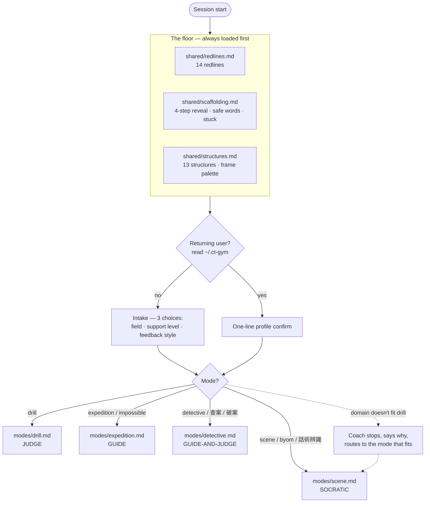
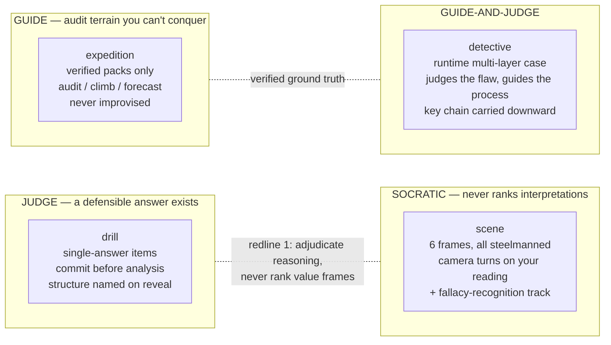
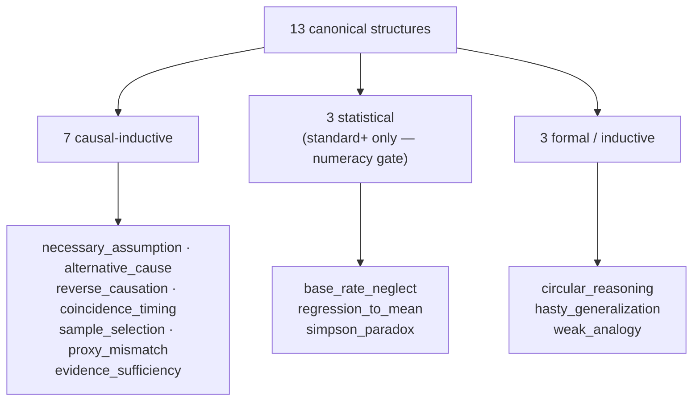
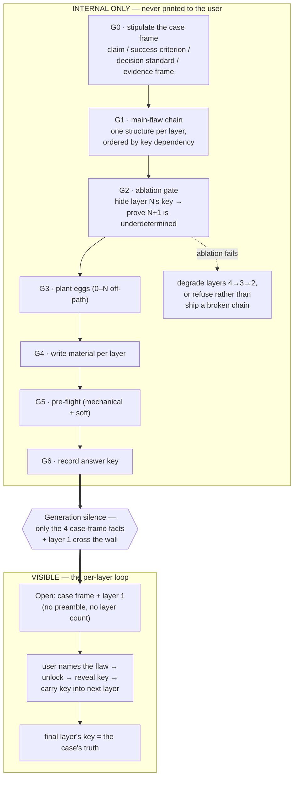
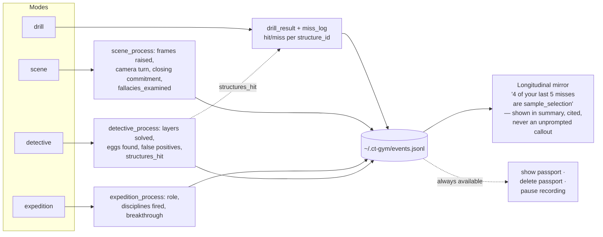
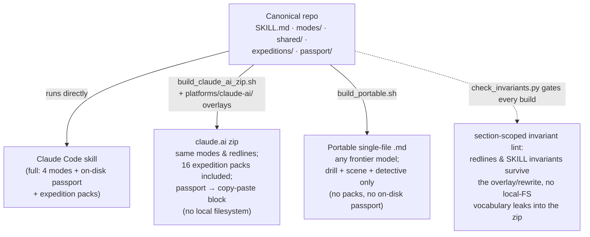

# Architecture (v1.2.0)

How `critical-thinking-for-humans` is put together: what loads when, how a
session routes to one of four modes, how the thirteen reasoning structures are
organized, how detective generates a case without leaking its answer key, how
the on-disk passport records longitudinal patterns, and how the three build
targets relate.

This document is the visual map; the canonical behavior lives in `SKILL.md`,
`modes/`, and `shared/`. Where this doc and a runtime file disagree, the runtime
file wins.

---

## How to read

- **Stance** is the epistemic posture a mode takes: *judge* (a defensible answer
  exists, wrong is called wrong), *Socratic* (never ranks interpretations),
  *guide* (audits terrain you are not expected to conquer), or *guide-and-judge*
  (judges the conclusion, guides the process).
- **The floor** is the stance-neutral base loaded on every session before any
  mode: the fourteen redlines, shared scaffolding, and the canonical structures.
- **The passport** is a local-only record at `~/.ct-gym/` — it never leaves your
  machine.

---

## 1. Session bootstrap & mode routing

Every session loads the same floor first, then routes. Only one mode file is
loaded per session.

Safe words (`stuck`, `hint`, `enough for today`, `forget this one`) are
announced once at start and honored in every mode (redline 8).

---

## 2. The four modes × stance

The modes are deliberately different epistemic instruments. The split is the
point: a gym that trains reasoning must not pretend "which symphony is better"
and "does this study's evidence support its claim" have the same shape.

| Mode | Material source | Judges? | Closes with |
|------|-----------------|---------|-------------|
| **drill** | generated items, your field | yes (one answer) | structure named, added to per-structure record |
| **scene** | synthetic **or** your own (BYOM) | no (frames never ranked) | your committed position vs the strongest objection |
| **expedition** | curated verified packs | yes (against the pack) | breakthrough articulated, role-specific record |
| **detective** | generated case, your field | conclusion yes / process guided | case cracked, key chain = the case's truth |

---

## 3. The thirteen reasoning structures (drill's keying set)

Drill keys on one of thirteen structures. They split three ways — and that split
decides which fields drill can serve natively and which route to scene instead.

Each structure is a transferable shape: once you can see `sample_selection` as a
shape, you catch it in a journal, a news story, or a contract. Naming is what
makes the practice transfer.

---

## 4. Detective generation pipeline (reverse design, keys first)

Detective reverse-designs a case before writing any prose — and the entire
pipeline runs **internally**. The answer key never reaches the visible chat
(generation silence); `Gate 9F` exists to guard exactly this property.

The load-bearing rule: **the user names each main flaw; the coach never catches
it for them.** A correct objection the answer key missed is inspected and
honestly confirmed, never auto-ruled a false positive — redline 14 (concede on
the merits: a self-authored key is not authority to defend behind, and the
inspection must tilt against the key, not against the user), reinforcing redline
4's correctness-honesty applied to the user's side.

---

## 5. Passport data flow (local-only)

The passport at `~/.ct-gym/events.jsonl` records process, not grades. Each mode
writes its own process event (drill also emits a `miss_log`), alongside
session-level `profile_set` and `commitment` events; structure hits feed a shared
per-structure record so coverage is unified across modes.

Redline 12 keeps this honest: relevant passport content enters the model context
only when used; a sensitive BYOM session writes no events at all unless you ask.

---

## 6. Three build targets

The repo is the single source of truth. Two other editions are generated from
it and never hand-edited.

Maintenance rule: editing a canonical file that has an overlay counterpart means
reviewing the overlay in the same commit. `check_invariants.py` re-checks every
redline and SKILL.md invariant against the overlay copies and fails the build on
drift.

---

## 7. The floor: fourteen redlines

Every mode binds all fourteen. When any instruction conflicts with a redline,
the redline wins.

| # | Redline | # | Redline |
|---|---------|---|---------|
| 1 | Adjudicate reasoning, never rank interpretations | 8 | Safe words always honored |
| 2 | Steelman duty | 9 | Fenced data (prompt-injection defense) |
| 3 | Graph silence (scene) | 10 | Real persons — de-identify, no character claims |
| 4 | No flattery (wrong is never called right) | 11 | No motive claims about the model |
| 5 | Anti-indoctrination palette | 12 | Passport honesty (local-only honest) |
| 6 | No real test items | 13 | Recognition, never production (manipulation) |
| 7 | No identity inference | 14 | Concede on the merits, never to please |

Detective adds a mode-local **generation silence** rule (the answer key never
reaches the visible chat) as the analogue of redline 3's graph silence — kept in
`modes/detective.md` rather than promoted to a global redline, since it governs
one mode.
